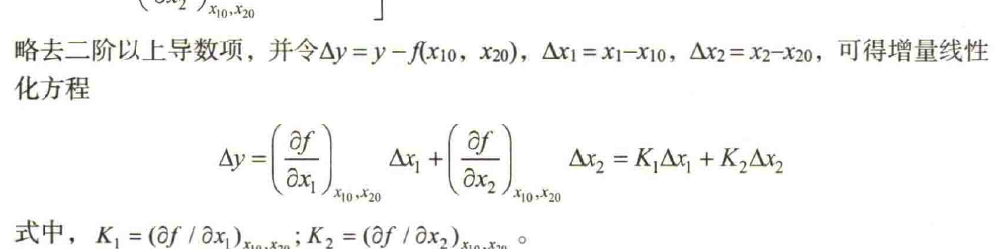
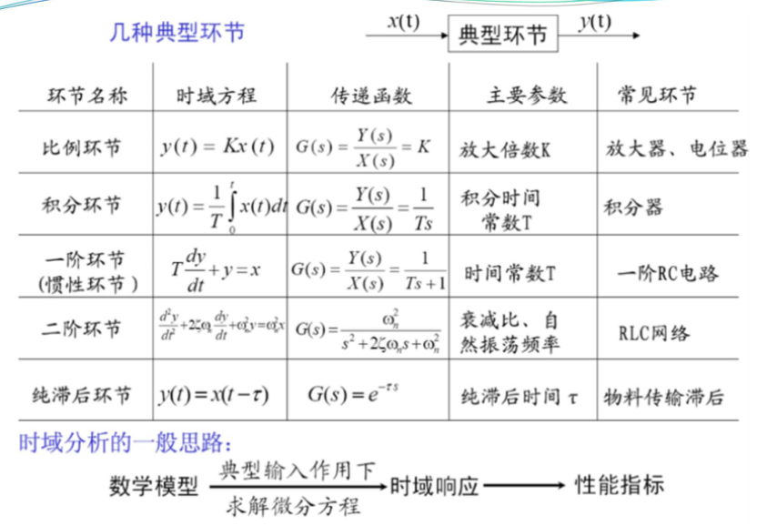
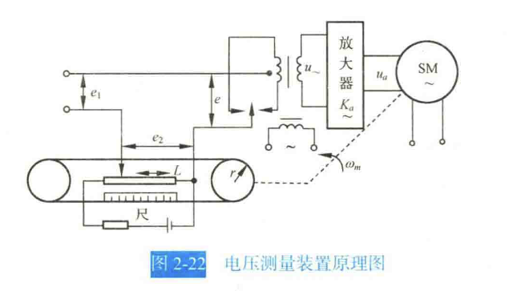
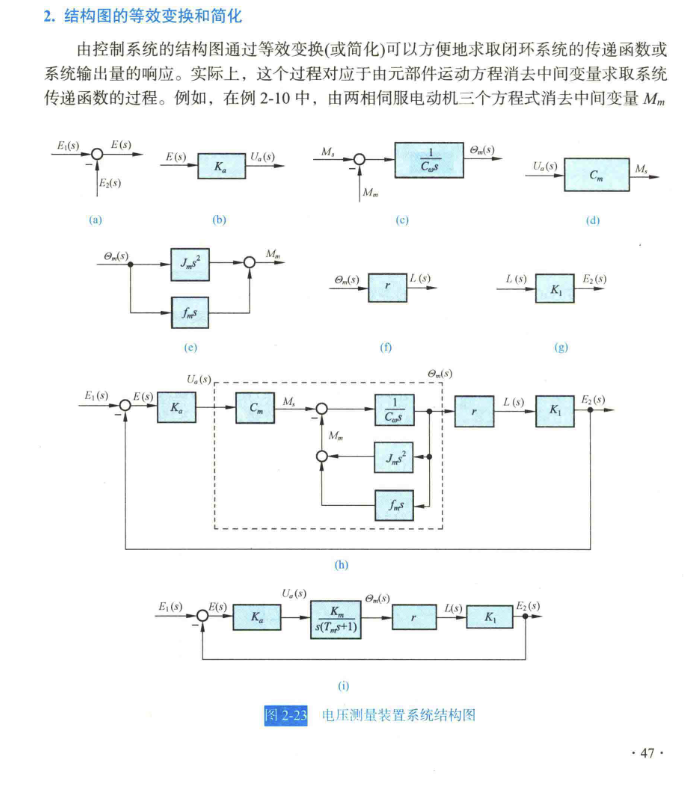

20230905

# 1. Laplace
1. 胡的书的P623-P 有具体推导过程.课后补上手算.注意迪利克雷第三条件对傅里叶变换的影响,
2. 拉氏变换性质(胡P625-)
- 线性定理
   - 微分定理
   - 积分定理(与微分定理对称)
   - 初值定理
   - 终值定理($t\rightarrow )
   - 位移定理
   - 相似定理
   - 卷积定理
3. 常用变换对
   - e.g. $e^{-at}f(t) = F(s+a)$ 
4. 常见拉氏反变换
5. 按$F(s)$分母$A(s)$特征根情况进行因式分解
   1. $A(s)=0$无重根,
   2. $A(s)=0$有重根(用留数法,回去复习复变函数).


---

1. 课本例题
- 查表法求解(就是那什么拉氏变换的解法)
- 特征根法(分母因式分解,观察$A_s=0$根的情况.无重根/有重根分别计算.)
1. 非线性方程线性化方法
- 切线法(小偏差线性化法)
    - ······？小信号模型我草,又是什么新命名...😅
    - 6,能不能别乱命名了
    - $\delta y = K\delta x$
    - 两个变量时的公式
1. 运动的模态(用微分方程特征根求解的办法)
   - 有重根/无重根对应模态
   - 通解由微分方程特征根决定,代表自由运动.
    - 无重根/多重根/共轭复根
2. 复数域的数学模型
   - **传递函数**
   - 频率法&根轨迹法
   - LTI的传递函数 

---
# 2. 第二章 描述系统的数学模型
## 2.1. 传递函数

(啊?什么时候讲了)
1. 定义
   1. 零初始条件下的输出与输入的拉氏变换比
   2. $$G(s) = \frac{C(s)}{R(s)} = \frac{\mathscr{L}[c(t)]}{\mathscr{L}[r(t)]}$$
   3. 
2. 性质
   1. 分子阶次不高于分母阶次
   2. 与输入输出量无关,是系统本身性质
   3. 微分方程的那什么因式分解有相通性
   4. $G(s)$的拉氏反变换是脉冲响应$g(t)$(没懂为什么)
3. 课本例题(P35 例2-9)
   1. (复习一下电机学的知识,不记得谁入谁出了)
   2. 利用线性叠加性,令$M_c(t)$和$u_a(t)$分别等于$0$,分别求出对应的传递函数.
4. 零点和极点
   1. $分子=0\rightarrow 零点 \rightarrow \circ$
   2. $分母=0\rightarrow 极点$
   3. 传递系数/根轨迹系数,式2-41
   4. 频率法,式2-42
5. 零极点对输出影响
   1. 与模态相关(极点决定,零点不影响)
   2. 例题可见,整理后的模态具有输入信号的模态,还含有由**极点**决定的自由运动的模态(自由运动?强迫运动?是什么?)
   3. **零点**影响各响应的比重
   4. 响应曲线:零点相对于极点的距离决定模态在输出响应中的占比(课件p57),从而影响曲线的形状
   5. 零极点距离较近时,彼此作用削弱
6. 课本例子
   1. 依靠输入和输出之间的关系解出传递函数(能够消掉变量得到入&出之间的关系)
   2. p42单容水槽
   3. p43有纯延迟的单容水槽
   4. p44双容水槽(与$\delta h_1$和$\delta u$之间关系有关)(出现二阶导)

## 2.2. 系统框图
*开个不知道什么的头*

2-3的
复现一下表格方便看：
||||||
|:---:|:---:|:----:|:----:|:----:|
|环节名称|时域方程|传递函数|主要参数|常见环节
|比例环节|$y(t)=K(t)$|$G(s)=\frac{Y(s)}{X(s)}=K$|放大倍数$K$|放大器/电位器|
|积分环节|$y(t)=\frac{1}{T}\int_0^tx(t)\,\mathrm{d}t$|$G(s)=\frac{Y(s)}{X(s)}=\frac{1}{Ts}$|积分常数$T$|积分器
|惯性环节(一阶环节)|$T\frac{\,\mathrm{d}y}{\,\mathrm{d}t}+y=x$|$G(s)=\frac{Y(s)}{X(s)}=\frac{1}{Ts+1}$|时间常数$T$|一阶$RC$电路/低通滤波器
|二阶环节|$\frac{\,\mathrm{d}^2y}{\,\mathrm{d}t^2}+2\zeta\omega_n+\omega^2_ny=\omega_n^2x$|$G(s)=\frac{\omega_n^2}{s^2+2\zeta \omega_ns+\omega_n^2}$|衰减比、自然振荡频率|$RLC$网络
|纯滞后环节|$y(t)=x(t-\tau)$|$G(s)=e^{-\tau s}$|纯滞后时间$\tau$|物料传输滞后

纯微分环节时域方程:$y(t) = K\frac{\,\mathrm{d}x(t)}{\,\mathrm{d}t}$

0. 几种典型环节
   - 比例环节:传递函数为常数,$G(s)=K$
   - 积分环节
   - 一阶环节(惯性环节)
   - 二阶环节(衰减比/自然振荡频率)
   - 纯滞后环节
1. 常见典型基本环节(与传递函数有关)
   - 放大(比例)(比例系数=常数)
   - 惯性:
      - $$G(s)=\frac{K}{Ts+1}$$
   - 积分
      - 出的变化速度和入成正比
   - 振荡(质量块-弹簧-阻尼器模型)
   - 纯微分
   - 一阶微分
      - 微分和比例的并联(PD?),惯性的倒数
   - 二阶微分
      - 振荡的倒数
   - 延迟
> 这是对于系统组成环节的补充和拓展,主要与后面章节有关
1. 结构图
   1. 组成与绘制(P45)
      - 信号线
      - 引出点
      - 比较点:出$=$入的代数和
      - 方框:数学变换
   2. 方框图绘制(P46自己看去)
      - 例2-10,P46
      - 关联P41两相伺服
   3. 结构图的等效变换和简化
      1. 等效
         - 三种典型结构
         - 串联:P48,传递函数的乘积,可推广到$n$个的情况
         - 并联:P48,输出量的代数和,可推广到$n$个的情况
         - 反馈:P49,类似于解方程组消去中间变量的形式来求得简化后的传递函数.
         - $$闭环传函=\dfrac{前向通道的传函}{1\pm 前向通道传函\times 反馈通道的传函}$$
         - $$闭环传函=\dfrac{前向分子\times 反馈分母}{分母乘积\pm 分子乘积}$$
         - $\uparrow$很实用的结论
         - $$开环传函G_K(s)=G(s)H(s)$$
      2. 简化
         - 移动引出点(也是列出移动前后的输入出量之间的关系,保持等效性得到方程(组),然后解方程得到新的传函)
         - 移动比较点(列解)
         - 有前移和后移~~(*后移不太理解)~~*已解决
         > P49写出原方框和等效方框的变换过程
      3. 例子:P51例2-11~~(晕乎乎的听得)(*受不了课后请求板书示范)~~*已解决
         - 利用引出点后移+反馈等效
         - 某个结论:
         - $$\dfrac{C(s)}{R(s)}=\dfrac{前向通道乘积}{1+负反馈回路乘积-正反馈回路乘积}$$
            - 前置条件:没有两两互不接触(三三互不接触)的回路
            - 关联:梅森增益公式
## 2.3. 信号流图
   1. 概述
      - 节点
      - 支路
      - 信号
      - 不唯一 
   2. 组成结构
      1. P54
      2. 源节点(入)
      3. 阱节点(出)
      4. 混合
      5. 前向通路: 起到终,各节点只通过一次
      6. 回路
      7. 回路增益
      8. 不接触回路
   3. 绘制
      1. +系统结构图
      2. P55(图是那个P46电压测量装置的流程图+信号流图改)
      3. 
      4. 
   4. 性质
      1. 节点相关
      2. 支路   
3. 梅森增益公式推导
   1. P57例(鬼才,这也能链到用矩阵找规律)
   2. 输入节点的信号全右,输出节点的信号全左
   3. 写出对应的矩阵(晚点学学矩阵的代码)
   4. 解出系数行列式
   5. 找个规律(有点糊):
      1. 前向通路/回路共几条
   6. (但是结果非常的简洁美观)
      1. $$P=\frac{1}{\Delta}\sum_{k=1}^{n}p_k\Delta_k$$
      2. $$\Delta=1-\sum L_a+\sum L_bL_c-\sum L_dL_eL_f+\dots$$
4. 实例(我超梅森好神一下子非常简明了)
   1. P59例2-14
      1. 找前向通路
      2. 找回路,写出回路增益
      3. 找出回路间互不接触的回路(单独回路/两两互不接触/三三互不接触/$\dots$)
      4. 找出与前向通路互不接触的回路
   2. P59例2-15 
      1. 拓:求解$\frac{X_2}{X_1}$(作一下变换输出后的图)
      2. 
      ```mermaid
      graph LR
      1(x1)
      2(x2)

      1(x1)-->|a|2(x2)

      ```
   3. P60例2-17
      1. 1-(G2)-(-1)-(G1)
---

20230919

闭环系统的传递函数
0. 基本思想
1. 输入信号作用下的
2. 扰动作用下的
   1. *为什么可以使$|G_1G_2H|\gg 1$?

*?没了?   

应掌握:
- 系统方框图的绘制方法
   - 三个环节
   - 引出点/比较点的移动对信号的影响
- 信号流图
   - 绘制(由公式画&由框图画)
   - 一些规律(*实际是梅森增益的简化版)
- 梅森增益公式
   - 推导
   - 前置条件(*找回路*)
   - 公式本身
   - *啊?

**作业0926交, 同步上传学习通**

---
**课程安排**

学到第四章,学习分析方法来看待系统.

|3|4|5|
|---|---|--
|时域|根轨迹|频率响应

校正&设计$\to$自控(2)


---
# 3. 第三章咯 时域分析方法
   - 优点:直观准确; 缺点:计算复杂
   - (进行一些不知道在回顾什么的回顾)
## 3.1. 性能指标
0. 学会用MATLAB辅助计算,低阶要掌握手算.学习稳定性的分析和误差计算.
1. 典型输入信号
   1. 单位加速度函数使用时注意系数时$\frac{1}{2}$
   2. 单位脉冲函数:好用,但实际不存.
   3. 正弦:频域分析多用
2. 动态过程&稳态过程
   1. 动:
      1. 定义:初始$\to$最终的响应过程.
      2. 包括:衰减&发散&等幅振荡.
      3. 从阶跃函数入手学习(最苛刻的条件).
      4. 可用的系统应该是**衰减的**.
   2. 稳
      1. 定义:时间趋于无穷的过程.$t\to \infty$.
3. 动态性能与稳态性能
   1. 动(P75)
      1. 延迟时间$t_d$
      2. 上升时间$t_r$
      3. 峰值时间$t_p$
      4. 调节时间$t_s$
      5. **超调量$\sigma \%$**: 若 $c_(t_p)<c(\infty)$ ,无超调
         $$\sigma \% = \frac{c(t_p)-c(\infty)}{c(\infty)}\times 100\%$$
   2. 稳
      1. 稳态误差
## 3.2. 一阶系统的时域分析
0. 
1. 一阶微分方程&标准形式
2. 单位阶跃响应
   1. 输入信号位$r(t)=1(t)$
   2. 公式:$c(t)=1-e^{-t/T},t\geq 0$
   3. 特点:
      1. /
      2. 初始斜率


# 4. 附录
---

*补公式的笔记

---

*一些疑问
1. 模态是什么(我知道课本有)?为什么要引入模态?引入模态的作用是什么?是要描述系统的运动状态吗?如何描述的?可以用具体的例子解释吗?或者可视化一下, 太抽象且突兀了
2. 