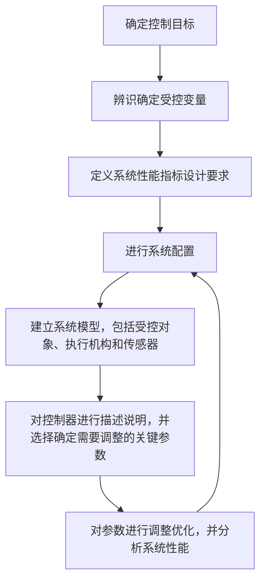

# Modern Control System(Twelfth Edition)
# 现代控制系统（第十二版）

## some targets
- [ ] 单位阶跃响应
- [ ] 时域、频域，相频、幅频
- [ ] ※PID控制器※
- [ ] 自激电路

## catalog of textbook
1. 控制系统导论
2. 系统数学模型
3. 状态空间模型
4. 反馈控制系统的特性
5. 反馈控制系统的性能
6. 线性反馈系统的稳定性
7. 根轨迹法
8. 频率响应法
9. 频域稳定性
10. 反馈控制系统设计
11. 状态变量反馈系统设计
12. 鲁棒控制系统
13. 数字控制系统

### 控制系统导论
1. Abstract
   - 系统→周边环境的一部分
   - 控制系统设计流程图

2. Chat